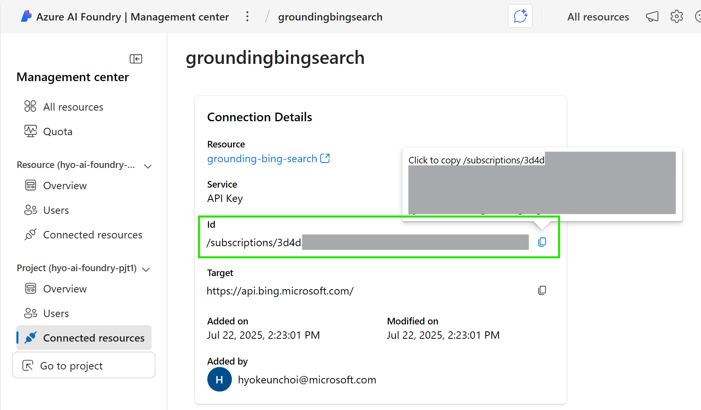

# Backend

The backend provides a RESTful API for the chatbot, handling natural language processing, search, and responses through Azure OpenAI services.

## Development Setup

### Prerequisites

- Python 3.9 or higher
- [uv](https://github.com/astral-sh/uv) package manager
- Azure subscription with OpenAI service enabled
- uv
```bash
uv venv .venv --python 3.12 --seed
source .venv/bin/activate
```


### Installation

1. Clone the repository:
   ```bash
   git clone https://github.com/yourusername/plan-search-chatbot.git
   cd plan-search-chatbot/app/backend
   ```

2. Install backend dependencies using uv:
    ```bash
    uv pip install -e .
    ```

    For development dependencies:
    ```bash
    uv pip install -e ".[dev]"
    ```

3. Set up environment variables:
   ```bash
   cp .env.example .env
   ```
   Then edit the `.env` file and add your Azure OpenAI credentials:
   ```
   AZURE_OPENAI_API_KEY=your-api-key-here
   AZURE_OPENAI_ENDPOINT=https://your-resource-name.openai.azure.com/
   AZURE_OPENAI_API_VERSION=2023-12-01-preview
   AZURE_OPENAI_DEPLOYMENT_NAME=your-deployment-name
   AZURE_OPENAI_QUERY_DEPLOYMENT_NAME=your-query-deployment-name
   
   # Bing Search API Configuration
   BING_API_KEY=
   BING_CUSTOM_CONFIG_ID=
   # When you use the Bing Custom Search API, you need to set the custom configuration ID.
   
   # Planner Settings
   PLANNER_MAX_PLANS=3

   # Bing Grounding
   # https://github.com/Azure/azure-sdk-for-python/blob/main/sdk/ai/azure-ai-agents/samples/agents_streaming/sample_agents_stream_iteration_with_bing_grounding.py
   BING_GROUNDING_PROJECT_ENDPOINT=https://<your-ai-services-account-name>.services.ai.azure.com/api/projects/<your-project-name>
   BING_GROUNDING_AGENT_MODEL_DEPLOYMENT_NAME=gpt-4o
   BING_GROUNDING_CONNECTION_ID=/subscriptions/{subscription-id}/resourceGroups/{resource-group-name}/providers/Microsoft.CognitiveServices/accounts/{ai-foundry-account-name}/projects/{project-name}/connections/{connection-name}
   BING_GROUNDING_MAX_RESULTS=5
   SEARCH_GEN_AGENT_ID=<your-agent-id>
   SEARCH_AGENT_ID=<your-agent-id>

   ```

#### Getting BING_GROUNDING_CONNECTION_ID

   To get the `BING_GROUNDING_CONNECTION_ID`, follow these steps:
   1. Go to the Azure portal.
   2. Navigate to your Bing Resources.
   3. Add Grounding with Bing Search configuring resource group, name and pricing tier.
   4. Navigate to your AI Foundry a Project > management center > Connected resources.
   5. Add  a new connection and select the Grounding with Bing Search resource you created.
   6. Click "Create" to create the connection.
   7. Once created, go to the connection details.
   8. Copy the connection ID from the URL or the details page.
   ```
   The connection ID will look like this:
   /subscriptions/{subscription-id}/resourceGroups/{resource-group-name}/providers/Microsoft.CognitiveServices/accounts/{ai-foundry-account-name}/projects/{project-name}/connections/{connection-name}
   ```



   

### Running the Backend

Start the FastAPI server:
```bash
uv run run.py
```

The API will be available at:
- API: http://localhost:8000
- Documentation: http://localhost:8000/docs
- Alternative docs: http://localhost:8000/redoc

### Testing

The project includes a comprehensive test suite. To run the tests:

```bash
# Install test dependencies if you haven't already
uv pip install -e ".[dev]" 

# Run tests with verbose output
uv run pytest -v

```

### Evaluation 

The project includes a comprehensive evaluation suite. To run the evaluations:

```bash
uv run evals/batch_eval.py --input evals/data/RTF_queries.csv --max_concurrent 3 --max_tokens 1500 --query_rewrite true --plan_execute true --search_engine grounding_bing --limit 3

```

### Evaluation Script Arguments

The main evaluation script (`evals/batch_eval.py`) accepts the following arguments:

| Argument                | Short | Type    | Default                                         | Description                                                                                  |
|-------------------------|-------|---------|-------------------------------------------------|----------------------------------------------------------------------------------------------|
| `--input`               | `-i`  | string  | **Required**                                    | Path to the input CSV file containing queries.                                               |
| `--gen_output`          | `-g`  | string  | `evals/results/generated_results_<timestamp>.jsonl`   | Output path for generated responses in JSONL format.                                         |
| `--eval_output`         | `-e`  | string  | `evals/results/evaluation_results_<timestamp>.json`   | Output path for evaluation results in JSON format.                                           |
| `--max_concurrent`      | `-c`  | int     | `1`                                             | Maximum number of concurrent requests during response generation.                            |
| `--max_tokens`          | `-t`  | int     | None                                            | Maximum number of tokens for response generation.                                            |
| `--temperature`         | `-T`  | float   | None                                            | Temperature parameter for response generation.                                               |
| `--limit`               | `-l`  | int     | `3`                                             | Limit on the number of queries to evaluate.                                                  |
| `--query_rewrite`       | `-q`  | bool    | `True`                                          | Enable or disable query rewriting (`true`/`false`).                                          |
| `--plan_execute`        | `-p`  | bool    | `True`                                          | Enable or disable plan execution (`true`/`false`).                                           |
| `--search_engine`       | `-s`  | string  | `"bing_search_crawling"`                        | Search engine to use (`bing_search_crawling`, `bing_grounding_crawling`, `grounding_bing`, `google_search_crawling`). |
| `--interval`            | `-it` | float   | `1.0`                                           | Interval (in seconds) between query executions.                                              |
| `--verbose`             | `-V`  | flag    | `False`                                         | Enable verbose logging for detailed output.                                                  |


### API Endpoints

- `GET /health` - Health check endpoint
- `POST /chat` - Chat endpoint for interacting with the AI assistant

### Testing with curl

You can enable streaming responses by setting the `stream` parameter to `true`:

```bash
# Test chat endpoint with streaming enabled
curl -X POST http://localhost:8000/chat \
  -H "Content-Type: application/json" \
  -d '{
    "messages": [
      {
        "role": "user",
        "content": "hello"
      }
    ],
    "max_tokens": 1500,
    "temperature": 0.7,
    "stream": true
  }' --no-buffer
```

When streaming is enabled, the response will be delivered as Server-Sent Events (SSE) with partial message chunks as they're generated. Each chunk is delivered in the format:

```
data: {"chunk": "Hello"}
data: {"chunk": "! How can I help you with Microsoft"}
data: {"chunk": " products today?"}
...
data: [DONE]
```

Your client code should parse these events to progressively display the response to the user.

## Azure OpenAI Configuration

This project uses Azure OpenAI services for the chatbot functionality. The configuration includes:

- **API Key**: Authentication for Azure OpenAI service
- **Endpoint**: Your Azure OpenAI service endpoint
- **Deployment Name**: The specific model deployment to use
- **API Version**: Azure OpenAI API version

Ensure your Azure OpenAI deployment has sufficient capacity and appropriate content safety settings for your use case.


